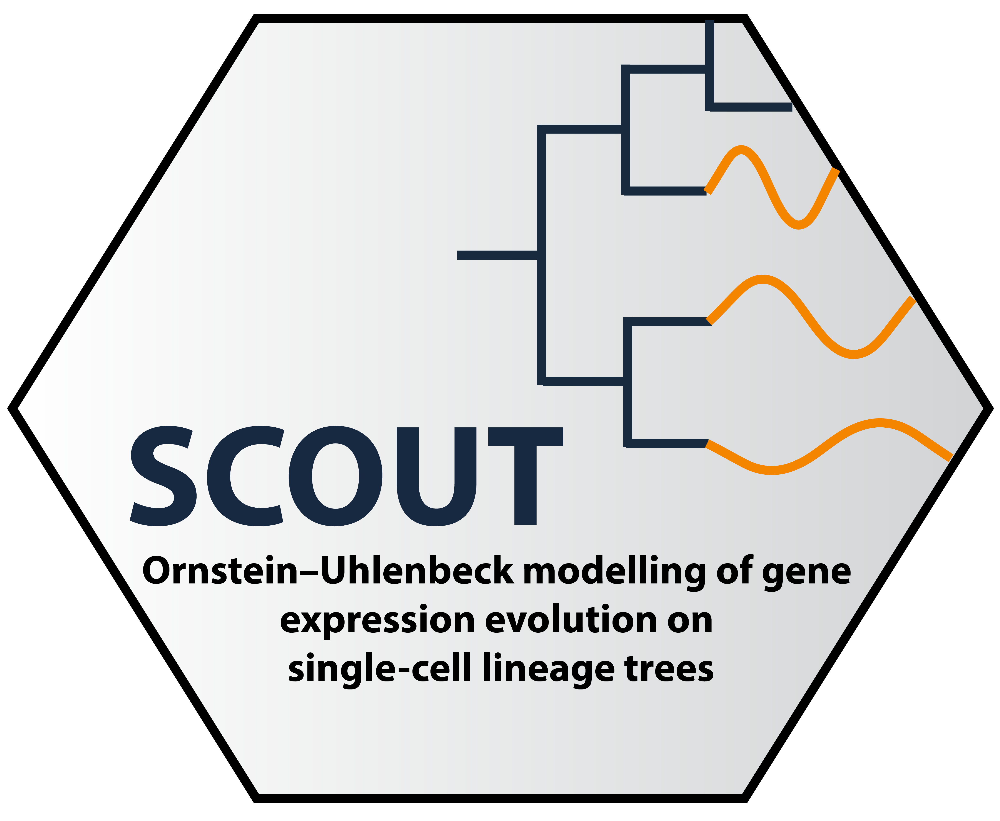

# devtools <a href="https://github.com/hrstuart/SCOUT">
  
</a>

## SCOUT: Ornstein–Uhlenbeck modelling of gene expression evolution on single-cell lineage trees

Given a single-cell lineage tree, fit gene expression to evolutionary models to profile selection and drift.


Check out our pre-print [here](https://www.biorxiv.org/content/10.1101/2025.11.12.688020v1)! 
### Overview

SCOUT is an R package that applies Ornstein-Uhlenbeck (OU) modeling to analyze gene expression evolution along single-cell lineage trees. The package enables researchers to:
- Fit multiple evolutionary models (Brownian Motion, Ornstein-Uhlenbeck) to gene expression data
- Compare models to identify genes under selection vs. neutral drift
- Analyze regime-specific evolutionary dynamics across lineage trajectories
- Perform model selection using information criteria (AIC)

SCOUT has three available versions. SCOUT-EM is an expectation-maximization approach which assumes an unobserved latent expression state governed by the evolutionary dyanmics of the OU-model. Thus, expression is estimated in its latent state in the E-step of the model. OU-parameters are estimated in the M-step. SCOUT, or SCOUT-SM is a baseline framework which uses a lineage smoothing preprocessed step to handle transcriptional noise. The OU-parameters are optimized akin to just the M-step with no additional noise modeling. Finally, we also include the option to run the model a concept called 'tip-fog' which models measurement error from the assumed evolutionary model. For for information on tip-fog, check out: [Beaulieu and O'Meara 2025](https://academic.oup.com/evolut/article/79/7/1131/8104471).

### Dependencies

SCOUT relies on the following R packages:
- `future.apply` - Parallelization 
- `ape`, `paleotree` - Phylogenetic analyses
- `TedSim` - Simulation framework (install from GitHub: `Galaxeee/TedSim`)
- `corpcor` - Matrix operations
- `nloptr` - Optimization
- 
Most should be installed 

### Installation

First install TedSim and it's dependencies; there may be some additional TedSim dependencies to track down depending on your system setup:
```r

install.packages("remotes")

remotes::install_github("dynverse/dyno")

if (!require("BiocManager", quietly = TRUE))
    install.packages("BiocManager")
	
BiocManager::install("SummarizedExperiment")


BiocManager::install("Rtsne")

# Install dependencies
devtools::install_github("Galaxeee/TedSim")
```

Once TedSim is installed you can install SCOUT:

```r
# Install SCOUT from GitHub
devtools::install_github('https://github.com/hrstuart/SCOUT/')
```
### Quick Start

#### Step 1: Prepare your data

SCOUT requires two main inputs:

1. **Phylogenetic tree**: A Newick format file containing the single-cell lineage tree
2. **Metadata**: A CSV file with cell barcodes, gene expression values, and regime annotations

**Example metadata format:** 
| cellBC             | OU4 | HES4      | ISG15     | AGRN      | SDF4      |
|--------------------|-----|-----------|-----------|-----------|-----------|
| ACGGAGAGTAAGCACG-1 | LL  | 0         | 0         | 0         | 0.577392  |
| ACTTACTAGGAATGGA-1 | LL  | 0.7890783 | 0.1583906 | 0.5226525 | 0.1583906 |
| AGCGGTCCAACACGCC-1 | RL  | 0.197258  | 0.3619425 | 0         | 0.6271318 |
| AGTGTCATCGGAGCAA-1 | M   | 0.3356066 | 0.3356066 | 0.5864398 | 0.3356066 |
| ATAGACCCAGCCAGAA-1 | LL  | 0         | 0.7329661 | 0.3077897 | 0         |
| CATCGGGCATGACATC-1 | Liv | 0.3847468 | 0.3847468 | 0         | 0.6619065 |

- The first column contains cell barcodes
- `OU4` is a regime column (containing regime labels like LL, RL, M, Liv)
- Remaining columns contain gene expression values (can be raw counts or normalized)

### Running SCOUT
#### Workflow 
First, `formatSCOUT` prepares the data for analysis with the core function in the model `runSCOUT`. This produces an rds file with annotations and further post-processing is needed to extract gene names and annotations. The wrapper function `SCOUT` runs all steps and returns a table with genes and annotations, as well as $\alpha$ and $\sigma^2$ parameter estimates. Since, $\theta$ estimates differ by model, those are returned separately. 

**Key parameters**: 
* *counts.file* | Path to counts file with OUx annotations for any non-BM/OU1 hypotheses. Key columns: 'species' (or specify the column name with the tip-labels with the argument 'species_key'), OUx, genes. 
* *tree.file* | Path to tree newick file. Tip labels should match counts file.
*  *results.dir* | Output path. SCOUT writes results to this directory.
*   *regimes* | Regimes of interest. Defaults to BM, recommended to run BM1, OU1, and OUX. 
* *blacklist* | Test genes are automatically inferred from the column names in the counts file. If there are any columns that are not either the species identifier or an OUX model, list here to avoid being considered a 'gene'.
* *method* | EM (full EM model), SM (smoothing model), MTF (tip fog model). Default is EM.
* *normalize* | Boolean whether to normalize counts. Set to FALSE if already normalized.
* *scale_tree* | Boolean whether to scale the tree height to 1. Recommended for small branch length trees.
*  **Model-Specific Parameters**
    - smoothing_k | (int) default = 8, higher values reads in information from farther away leaves.
    - tau_prior_sd and tau_prior_mean | [0, 1] control on the tau prior for the EM model. Recommended < 0.4.
    - fixed.root | whether the root is estimated or 'absorbed' into the initial regime (not estimated). Default is fixed.
    - lambda1 and lambda2 | [0,1] how much weight to place on the priors. Both should be non-zero for best performance. Both default to 0.2.
      
```r
# Minimal example for SCOUT-EM
scout.res <- SCOUT(counts.file = <path to counts file>,
    tree.file = <path to tree file>,
    results_dir = <outpath>,
    regimes = c("BM1", "OU1", "OUX"),
    cores = 16,
	logfile = 'logfile.log',
	verbose=TRUE
)
```

This returns a list with a dataframe of gene annotations (best fit models) and a list of dataframes with parameter estimates corresponding to each model fit. 

### Understanding the Models

- **BM1** (Brownian Motion): Models trait evolution as a random walk with constant variance. Assumes no selection.
- **OU1** (Single Ornstein-Uhlenbeck): Models evolution toward a single optimum with selection strength α and trait optimum θ.
- **OUM** (Multiple Optima OU): Models evolution with different trait optima for different regimes (e.g., different cell types or lineages).

### Examples and Vignettes

See detailed examples in the `examples/` directory:
  - **SimulationVignette.ipynb**: Walkthrough using simulated data to demonstrate SCOUT workflow
  - **simulate_data/**: Scripts for generating simulation datasets

### Citation

If you use SCOUT in your research, please cite:

Stuart, H., & McKenna, A. (2025). SCOUT: Ornstein–Uhlenbeck modelling of gene expression evolution on single-cell lineage trees. bioRxiv, 2025.11.12.688020. https://doi.org/10.1101/2025.11.12.688020

### License

MIT License

### Issues and Support

For bug reports and feature requests, please open an issue on the [GitHub repository](https://github.com/hrstuart/SCOUT/issues). 

